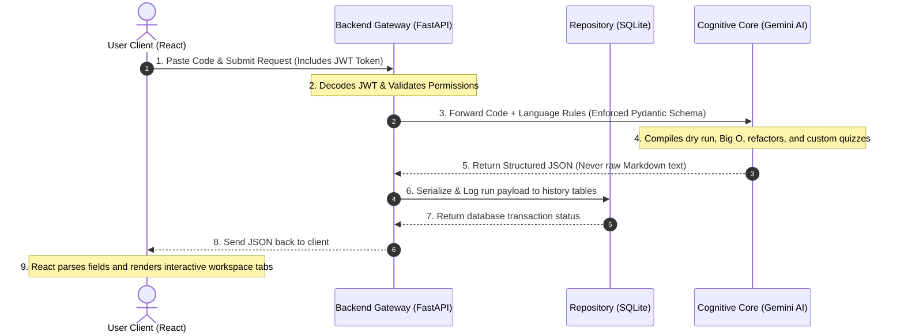

# CodeExplain - How It Works & Architecture Guide

Welcome to the **CodeExplain Technical Showcase** guide. This document details the visual goals, software architecture, technical data flow chart, and technology stack choices implemented to build this application. Use this document as your quick reference cheat sheet for preparing slides or explaining the project during reviews.

---

## 🎯 1. Project Objective & Core Focus

**CodeExplain** is an interactive, full-stack AI-Tutor platform designed to make software engineering concepts accessible to everyone. 
* **Target Audience**: Student developers, programming beginners, and technical interview candidates.
* **Core Problem Solved**: Traditional AI interfaces (like generic chat windows) return long, unstructured walls of text that confuse beginners. CodeExplain breaks down code files into specific, manageable categories (Time Complexity rationales, variables lists, dry run timelines, and interactive quizzes) so that learners can digest details step-by-step.
* **Design Aesthetic**: Premium white/light slate background theme with modern hover effects, shadows, and clean **emerald green (`#10B981`)** details to match the professional design system.

---

## 📊 2. System Data Flow Chart

This diagram shows how data travels through the full-stack architecture, from the moment a user inputs code to the final rendering of the interactive tabs.

---

## 🛠️ 3. Technology Stack & Design Rationale

Here is the exact technology stack used to build the application and the engineering reasons behind each choice:

### Frontend Layer
| Technology | Role | "Why We Used It" (Showcase Explanation) |
| :--- | :--- | :--- |
| **React (TypeScript)** | UI Framework | Organizes dashboard tabs (Explanations, Metrics, Refactors, Quizzes) into reusable components. TypeScript ensures structured data from the backend fits database interfaces without causing browser crashes. |
| **Vite** | Build Tool | Fast bundling pipeline that enables Hot Module Replacement (HMR) to speed up frontend development. |
| **Monaco Editor** | Code Sandbox IDE | The same core engine that powers Visual Studio Code. It provides native code editing features in the browser, including indentation and syntax highlighting. |
| **Tailwind CSS** | Design Utility | Speeds up custom UI development and ensures consistent theme tokens, border definitions, and responsive grids. |
| **Framer Motion** | Motion Animation | Drives smooth entrance animations and visual timeline step indicators on the workflow screens. |

### Backend Layer
| Technology | Role | "Why We Used It" (Showcase Explanation) |
| :--- | :--- | :--- |
| **FastAPI (Python)** | API Framework | An asynchronous ASGI framework built for speed. It auto-generates interactive OpenAPI schemas, making it easy to test backend endpoints. |
| **Uvicorn** | ASGI Server | Lightweight web server that runs our backend application. |
| **Bcrypt & Passlib** | Encryption | Securely hashes passwords before database saving. |
| **PyJWT** | Session Authentication | Creates and decodes JSON Web Tokens (JWT) to secure user authentication without maintaining heavy sessions on the server. |

### Database & AI Integration
| Technology | Role | "Why We Used It" (Showcase Explanation) |
| :--- | :--- | :--- |
| **SQLite Database** | Data Storage | An embedded database that requires zero configuration. SQLite securely stores passwords, history records, and bookmarks locally. |
| **Google Gemini API** | AI Engine | Powers the logical code walkthroughs using state-of-the-art `gemini-2.5-flash` and `gemini-2.5-pro` reasoning models. |
| **Pydantic Schema Validation** | Schema Enforcement | Bridges natural language processing with strict data tables. By passing a Pydantic class (`CodeAnalysis`) to the Gemini API, we force the AI to return data in a strict structured JSON format. |

---

## 💡 4. PPT Presentation Showcase Tips

When presenting this project to reviewers:
1. **Highlight Schema Enforcement**: Emphasize that you aren't just display generic chat messages. You are using **Pydantic Schemas** to parse natural language AI responses into structured columns and variables.
2. **Demo the Workflow Screen**: Show off the `/workflow` route inside the application to prove you designed the architecture with clean data boundaries.
3. **Showcase the Monaco Integration**: Highlight that your app uses VS Code's editor engine, demonstrating your ability to integrate complex third-party tools.
